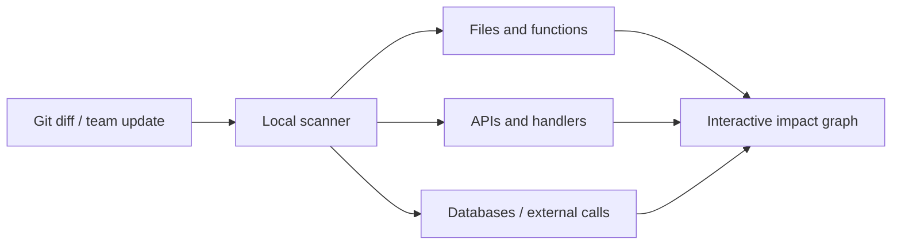

# Where am I

[English](./README.md) | [한국어](./README.ko.md)

[](https://github.com/soil0119/Where-am-i/actions/workflows/ci.yml)
[](./LICENSE)
[](./package.json)

여러 저장소를 일일이 오가며 추적하지 않아도 현재 변경이 파일·API·서비스·DB·테스트 어디까지 영향을 주는지 보여주는 로컬 우선(local-first) 영향 그래프입니다.

> [!IMPORTANT]
> Where am I는 초기 MVP입니다. 분석 결과를 배포·보안·호환성 판단의 유일한 근거로 사용하지 마세요.

## 왜 Where am I인가요?

멀티 저장소 환경에서는 작은 API 변경도 프론트엔드 wrapper, 백엔드 handler, 내부 서비스, DB schema, 문서와 테스트까지 이어집니다. Where am I는 로컬 Git 저장소에서 근거를 수집하고, 변경과 연결 관계를 클릭 가능한 영향 그래프로 보여줍니다.

## 주요 기능

- 현재 작업 트리 diff를 기준으로 영향받는 코드 흐름 표시
- 팀원 PR과 원격 커밋의 API·schema 변경 브리핑
- API path, handler, wrapper, OpenAPI 문서와 테스트 연결 확인
- 여러 저장소의 API catalog 통합 조회
- 함수, DB, 외부 API, 에러 코드를 파일 경로와 근거 라인까지 추적
- 온보딩을 위한 시스템 요약과 저장소별 구조 탐색



## 빠른 시작

### 요구 사항

- Node.js `>=22.13.0`
- 분석할 로컬 Git 저장소 한 개 이상

### 설치 및 실행

```bash
git clone https://github.com/soil0119/Where-am-i.git
cd Where-am-i
npm install
cp whereami.config.example.json whereami.config.json
npm run dev
```

Windows PowerShell에서는 `cp` 명령을 다음과 같이 바꾸세요.

```powershell
Copy-Item whereami.config.example.json whereami.config.json
```

`whereami.config.json`에서 분석할 workspace 경로와 저장소 이름 조건을 설정하세요.

```json
{
  "repoRoots": ["/absolute/path/to/your/workspace"],
  "include": ["your-repo-prefix"],
  "baseBranch": "develop",
  "autoFetch": true,
  "liveWatch": true
}
```

특정 저장소를 직접 지정할 수도 있습니다.

```json
{
  "repos": [
    {
      "name": "sample-api",
      "path": "/absolute/path/to/sample-api",
      "baseBranch": "main"
    }
  ]
}
```

전체 설정과 스캔 제한값은 [`whereami.config.example.json`](./whereami.config.example.json)을 참고하세요.

## 명령어

| 명령어 | 설명 |
| --- | --- |
| `npm run dev` | UI, 로컬 스캔 서버와 파일 변경 감시를 함께 실행합니다. |
| `npm run scan` | 설정한 저장소를 한 번 스캔합니다. |
| `npm run scan:watch` | 설정된 주기로 저장소를 다시 스캔합니다. |
| `npm run scan:server` | 수동 갱신과 실시간 이벤트용 로컬 서버를 실행합니다. |
| `npm run build` | 로컬 snapshot을 제외한 production bundle을 생성합니다. |
| `npm test` | production build와 테스트를 실행합니다. |
| `npm run lint` | 정적 코드 검사를 실행합니다. |

## 데이터와 개인정보 보호

Where am I는 설정한 저장소의 소스 코드를 로컬에서 읽습니다. 생성되는 `whereami.config.json`과 `public/whereami-snapshot.json`에는 다음 정보가 포함될 수 있습니다.

- 로컬 절대 경로와 저장소 이름
- branch, commit, PR 제목과 변경 파일
- 함수명, API path, 코드 근거 라인

두 파일은 기본적으로 Git에서 제외됩니다. Production build도 로컬 snapshot을 결과물에서 제거하고 내장 샘플 데이터를 표시합니다. 그래도 화면을 캡처하거나 결과를 공유하기 전에는 민감한 정보가 없는지 직접 확인하세요.

`autoFetch`를 활성화하면 스캔 시 각 저장소의 원격 Git 정보를 가져옵니다. 네트워크 접근을 원하지 않으면 `false`로 설정하거나 `npm run scan -- --no-fetch`를 사용하세요.

## 현재 한계

- 코드 관계는 정적 패턴 기반으로 추론하므로 동적 호출이나 복잡한 metaprogramming을 놓칠 수 있습니다.
- 지원 언어와 framework별 extractor 정확도가 아직 균일하지 않습니다.
- GitHub PR·branch 비교 브리핑과 extractor 정확도 개선은 진행 중입니다.

## 기여하기

영어와 한국어 기여를 모두 환영합니다. 버그 제보, 문서 개선, extractor 추가와 사용성 피드백 모두 좋은 시작점입니다.

Pull request를 열기 전에 다음 명령을 실행해 주세요.

```bash
npm ci
npm run lint
npm test
```

큰 변경은 먼저 [Issue](https://github.com/soil0119/Where-am-i/issues)를 열어 문제와 접근 방식을 논의해 주세요. 전체 절차는 [CONTRIBUTING.ko.md](./CONTRIBUTING.ko.md), 커뮤니티 행동 기준은 [CODE_OF_CONDUCT.md](./CODE_OF_CONDUCT.md)를 참고하세요.

## 보안

취약점을 공개 Issue로 제보하지 마세요. [SECURITY.ko.md](./SECURITY.ko.md)의 비공개 제보 절차를 따라 주세요.

## 라이선스

Where am I는 [MIT License](./LICENSE)로 배포됩니다.
