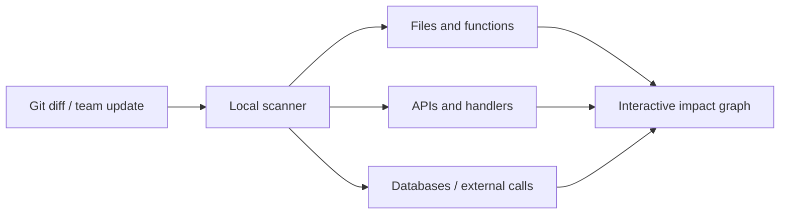

# Where am I

[English](./README.md) | [한국어](./README.ko.md)

[](https://github.com/soil0119/Where-am-i/actions/workflows/ci.yml)
[](./LICENSE)
[](./package.json)

A local-first impact graph that shows how code changes flow across files, APIs, services, databases, and tests—without making you trace every repository by hand.

> [!IMPORTANT]
> Where am I is an early MVP. Do not use its analysis as the sole basis for deployment, security, or compatibility decisions.

## Why Where am I?

In a multi-repository system, a small API change can affect a frontend wrapper, a backend handler, an internal service, a database schema, documentation, and tests. Where am I collects evidence from local Git repositories and turns those relationships into a clickable impact graph.

## Features

- Visualize code paths affected by the current working-tree diff
- Brief API and schema changes from teammates' pull requests and remote commits
- Connect API paths, handlers, wrappers, OpenAPI documents, and tests
- Search a combined API catalog across multiple repositories
- Trace functions, databases, external APIs, and error codes back to files and evidence lines
- Explore system summaries and repository-specific structure for onboarding



## Quick start

### Requirements

- Node.js `>=22.13.0`
- One or more local Git repositories to analyze

### Install and run

```bash
git clone https://github.com/soil0119/Where-am-i.git
cd Where-am-i
npm install
cp whereami.config.example.json whereami.config.json
npm run dev
```

On Windows PowerShell, replace the `cp` command with:

```powershell
Copy-Item whereami.config.example.json whereami.config.json
```

Set the workspace path and repository-name filter in `whereami.config.json`:

```json
{
  "repoRoots": ["/absolute/path/to/your/workspace"],
  "include": ["your-repo-prefix"],
  "baseBranch": "develop",
  "autoFetch": true,
  "liveWatch": true
}
```

You can also list repositories explicitly:

```json
{
  "repos": [
    {
      "name": "sample-api",
      "path": "/absolute/path/to/sample-api",
      "baseBranch": "main"
    }
  ]
}
```

See [`whereami.config.example.json`](./whereami.config.example.json) for every option and scan limit.

## Commands

| Command | Description |
| --- | --- |
| `npm run dev` | Run the UI, local scan server, and file watcher together. |
| `npm run scan` | Scan configured repositories once. |
| `npm run scan:watch` | Rescan repositories at the configured interval. |
| `npm run scan:server` | Run the local server for manual refreshes and live events. |
| `npm run build` | Build a production bundle without the local snapshot. |
| `npm test` | Run the production build and test suite. |
| `npm run lint` | Run static analysis. |

## Data and privacy

Where am I reads the source code in the repositories you configure. The generated `whereami.config.json` and `public/whereami-snapshot.json` may contain:

- Absolute local paths and repository names
- Branches, commits, pull request titles, and changed files
- Function names, API paths, and source evidence lines

Both files are ignored by Git by default. Production builds also remove the local snapshot and display bundled sample data. Even so, review screenshots and exported results for sensitive information before sharing them.

When `autoFetch` is enabled, the scanner fetches remote Git metadata for each repository. Set it to `false`, or run `npm run scan -- --no-fetch`, to avoid network access during a scan.

## Current limitations

- Relationships are inferred from static patterns, so dynamic calls and complex metaprogramming may be missed.
- Extractor coverage and accuracy vary by language and framework.
- Pull request and branch comparison briefings, along with extractor accuracy, are still being improved.

## Contributing

Contributions in English or Korean are welcome. Bug reports, documentation fixes, new extractors, and usability feedback are all useful places to start.

Before opening a pull request:

```bash
npm ci
npm run lint
npm test
```

For larger changes, please open an [issue](https://github.com/soil0119/Where-am-i/issues) first so we can align on the problem and approach. See [CONTRIBUTING.md](./CONTRIBUTING.md) for the complete workflow and [CODE_OF_CONDUCT.md](./CODE_OF_CONDUCT.md) for community expectations.

## Security

Please do not report vulnerabilities in a public issue. Follow the private reporting instructions in [SECURITY.md](./SECURITY.md).

## License

Where am I is available under the [MIT License](./LICENSE).
