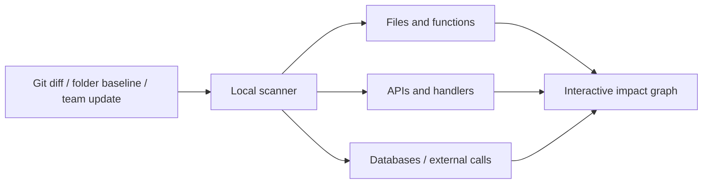

# Where am I

[English](./README.md) | [한국어](./README.ko.md) | [Tiếng Việt](./README.vi.md)

[](https://github.com/soil0119/Where-am-i/actions/workflows/ci.yml)
[](./LICENSE)
[](./package.json)

[Bản demo trực tiếp](https://where-am-i-soil0119.soil0119.chatgpt.site/) · [Bài viết kỹ thuật](https://dev.to/soil0119/how-i-built-a-local-first-impact-graph-for-multi-repository-code-changes-3kkg)

Biểu đồ tác động ưu tiên cục bộ (local-first) thể hiện luồng thay đổi mã nguồn qua các tệp tin, API, dịch vụ, cơ sở dữ liệu và kiểm thử—mà không yêu cầu GitHub hay bắt buộc bạn phải dò tìm từng kho lưu trữ thủ công.

> **Bản so sánh diff cho bạn biết những gì đã thay đổi. Where am I cho bạn thấy thay đổi đó dẫn đến đâu.**

> [!IMPORTANT]
> Where am I hiện là phiên bản MVP ban đầu. Vui lòng không sử dụng kết quả phân tích của công cụ làm căn cứ duy nhất cho các quyết định triển khai, bảo mật hoặc độ tương thích.

## Tại sao nên dùng Where am I?

Trong một hệ thống gồm nhiều nguồn mã, một thay đổi nhỏ về API có thể ảnh hưởng đến lớp bọc (wrapper) ở frontend, bộ xử lý (handler) ở backend, dịch vụ nội bộ, lược đồ cơ sở dữ liệu, tài liệu và các bài kiểm thử. Where am I thu thập bằng chứng từ các kho lưu trữ Git cục bộ hoặc các thư mục thông thường và biến những mối quan hệ đó thành một biểu đồ tác động có thể nhấp chuột tương tác.

## Điểm khác biệt là gì?

Where am I không thay thế nền tảng lưu trữ Git, IDE hay hệ thống giám sát (observability) của bạn. Công cụ này lấp đầy khoảng trống giữa việc chỉnh sửa mã nguồn và bước đánh giá (review) hoặc triển khai: **thay đổi này còn chạm đến những thành phần nào khác?**

| Cách tiếp cận phổ biến | Thế mạnh | Giá trị Where am I bổ sung |
| --- | --- | --- |
| GitHub hoặc PR diff | Hiển thị các dòng code bị thay đổi trong một lượt đánh giá | Đường dẫn tác động xuyên tệp tin và xuyên kho lưu trữ ngay cả trước khi tạo PR |
| Tìm kiếm tham chiếu trong IDE (IDE references) | Tìm kiếm biểu tượng trong phạm vi một ngôn ngữ hoặc workspace được hỗ trợ | Kết nối xuyên suốt qua các tuyến HTTP, wrapper, handler, tài liệu, schema và kiểm thử |
| Sơ đồ kiến trúc (Architecture diagrams) | Giải thích hệ thống theo tài liệu đã ghi chép | Quét lại working tree hoặc thư mục cơ sở để phản ánh chính xác mã nguồn của ngày hôm nay |
| Công cụ phân tích mã nguồn đám mây (Hosted code intelligence) | Xây dựng chỉ mục tập trung cho toàn tổ chức | Lựa chọn ưu tiên cục bộ (local-first), không cần tài khoản, không cần kết nối GitHub hay tải mã nguồn lên mạng |
| Bảng kiểm tra đánh giá thủ công (Manual review checklists) | Ghi nhận kiến thức và kinh nghiệm của nhóm | Các dòng bằng chứng có thể nhấp chuột và các phép kiểm tra hợp đồng lặp lại được tạo trực tiếp từ mã nguồn |

Sử dụng công cụ khi bạn cần:

- hiểu phạm vi ảnh hưởng (blast radius) của một thay đổi chưa commit;
- đánh giá một thay đổi API liên quan đồng thời tới frontend, backend, tài liệu và kiểm thử;
- kiểm tra nhiều kho lưu trữ hoặc các thư mục thông thường như một hệ thống thống nhất;
- làm việc với mã nguồn riêng tư cần được lưu giữ nguyên vẹn trên máy tính của lập trình viên;
- cung cấp cho người mới tham gia một bản đồ rõ ràng, có bằng chứng để biết nên bắt đầu xem xét từ đâu.

Biểu đồ được suy ra từ các quy tắc tĩnh (static rules) và bằng chứng mã nguồn có thể kiểm chứng được. Công cụ được thiết kế để hỗ trợ khả năng đánh giá của kỹ sư—chứ không giấu nó đằng sau một điểm số hay bản tóm tắt tự sinh thiếu cơ sở.

## Tính năng chính

- Trực quan hóa các đường dẫn mã bị ảnh hưởng bởi diff của working tree hiện tại hoặc thay đổi trong thư mục liên kết
- Tóm tắt các thay đổi về API và schema từ pull request của đồng đội và các commit từ xa
- Kết nối các đường dẫn API, handler, wrapper, tài liệu OpenAPI và kiểm thử
- Tìm kiếm danh mục API kết hợp trên nhiều kho lưu trữ
- Truy vết các hàm, cơ sở dữ liệu, lệnh gọi API bên ngoài và mã lỗi ngược trở lại tệp tin và dòng bằng chứng cụ thể
- Khám phá bản tóm tắt hệ thống và cấu trúc riêng của từng kho lưu trữ để làm quen dự án nhanh chóng



## Bắt đầu nhanh (Quick start)

### Yêu cầu hệ thống

- Node.js `>=22.13.0`
- Một hoặc nhiều kho lưu trữ Git cục bộ hoặc thư mục mã nguồn thông thường để phân tích

### Cài đặt và khởi chạy

```bash
git clone https://github.com/soil0119/Where-am-i.git
cd Where-am-i
npm install
cp whereami.config.example.json whereami.config.json
npm run dev
```

Trên Windows PowerShell, thay thế lệnh `cp` bằng:

```powershell
Copy-Item whereami.config.example.json whereami.config.json
```

Thiết lập đường dẫn workspace và bộ lọc tên kho lưu trữ trong `whereami.config.json`:

```json
{
  "repoRoots": ["/duong/dan/tuyet/doi/toi/workspace"],
  "include": ["tien-to-repo-cua-ban"],
  "baseBranch": "develop",
  "autoFetch": true,
  "liveWatch": true
}
```

Bạn cũng có thể liệt kê các kho lưu trữ một cách rõ ràng:

```json
{
  "repos": [
    {
      "name": "sample-api",
      "path": "/duong/dan/tuyet/doi/toi/sample-api",
      "baseBranch": "main"
    }
  ]
}
```

### Kết nối thư mục không dùng Git hoặc GitHub

Thêm một thư mục mã nguồn thông thường vào mảng `folders`. Lần quét đầu tiên sẽ tạo một đường chuẩn tệp cục bộ (file baseline); các lần quét sau sẽ hiển thị các tệp được thêm mới, sửa đổi hoặc xóa so với đường chuẩn đó.

```json
{
  "folders": [
    {
      "name": "my-local-project",
      "path": "/duong/dan/tuyet/doi/toi/my-local-project",
      "type": "platform"
    }
  ],
  "autoFetch": false
}
```

Đường chuẩn thư mục chỉ được lưu trong ảnh chụp cục bộ (snapshot) vốn đã được Git bỏ qua (ignored). Bạn có thể kết nối đồng thời cả kho lưu trữ Git lẫn các thư mục thông thường. Trình theo dõi trực tiếp (live watcher) cũng sẽ tự động quét lại các thư mục được liên kết sau khi có sự thay đổi tệp.

Xem [`whereami.config.example.json`](./whereami.config.example.json) để biết toàn bộ các tùy chọn cấu hình và giới hạn quét.

## Các câu lệnh (Commands)

| Câu lệnh | Mô tả |
| --- | --- |
| `npm run dev` | Chạy đồng thời giao diện UI, máy chủ quét cục bộ và trình theo dõi tệp. |
| `npm run scan` | Quét các kho lưu trữ đã cấu hình một lần. |
| `npm run scan:watch` | Quét lại các kho lưu trữ theo khoảng thời gian đã định cấu hình. |
| `npm run scan:server` | Chạy máy chủ cục bộ phục vụ các lần làm mới thủ công và sự kiện trực tiếp. |
| `npm run build` | Xây dựng bản phát hành sản xuất (production bundle) không kèm ảnh chụp cục bộ. |
| `npm test` | Chạy bản build sản xuất và bộ kiểm thử (test suite). |
| `npm run lint` | Chạy phân tích mã nguồn tĩnh (static analysis). |

## Dữ liệu và quyền riêng tư (Data and privacy)

Where am I chỉ đọc mã nguồn trong các kho lưu trữ và thư mục mà bạn đã cấu hình. Các tệp được tạo ra gồm `whereami.config.json` và `public/whereami-snapshot.json` có thể chứa:

- Đường dẫn cục bộ tuyệt đối và tên nguồn mã
- Nhánh, commit, tiêu đề pull request và danh sách tệp bị thay đổi
- Mã băm nội dung (content hashes) và số dòng của đường chuẩn thư mục
- Tên hàm, đường dẫn API và các dòng bằng chứng trong mã nguồn

Cả hai tệp này đều được Git bỏ qua theo mặc định. Các bản build sản xuất cũng loại bỏ ảnh chụp cục bộ và chỉ hiển thị dữ liệu mẫu đi kèm. Mặc dù vậy, hãy chủ động kiểm tra ảnh chụp màn hình và kết quả xuất ra để tránh lộ lọt thông tin nhạy cảm trước khi chia sẻ.

Khi bật tùy chọn `autoFetch`, bộ quét sẽ nạp siêu dữ liệu Git từ xa cho từng kho lưu trữ Git. Nguồn thư mục thông thường sẽ không bao giờ kết nối tới remote. Hãy đặt thành `false`, hoặc chạy lệnh `npm run scan -- --no-fetch`, nếu bạn muốn tắt hoàn toàn việc truy cập mạng trong quá trình quét.

## Giới hạn hiện tại (Current limitations)

- Các mối quan hệ được suy ra từ các mẫu tĩnh (static patterns), do đó các lệnh gọi động hoặc siêu lập trình (metaprogramming) phức tạp có thể bị bỏ sót.
- Độ bao phủ và độ chính xác của bộ trích xuất (extractor) sẽ khác nhau tùy theo ngôn ngữ và framework.
- Bản tóm tắt so sánh pull request và nhánh, cùng với độ chính xác của bộ trích xuất, vẫn đang tiếp tục được cải thiện.

## Đóng góp (Contributing)

Dự án hoan nghênh các đóng góp bằng tiếng Anh hoặc tiếng Hàn. Các báo cáo lỗi (bug reports), sửa đổi tài liệu, xây dựng bộ trích xuất mới và phản hồi về khả năng sử dụng đều là những khởi đầu rất hữu ích.

Trước khi mở một pull request:

```bash
npm ci
npm run lint
npm test
```

Đối với các thay đổi lớn hơn, vui lòng mở một [issue](https://github.com/soil0119/Where-am-i/issues) trước để chúng ta có thể thống nhất về vấn đề và hướng tiếp cận. Xem [CONTRIBUTING.md](./CONTRIBUTING.md) để biết quy trình làm việc đầy đủ và [CODE_OF_CONDUCT.md](./CODE_OF_CONDUCT.md) về các quy tắc ứng xử trong cộng đồng.

## Bảo mật (Security)

Vui lòng không báo cáo các lỗ hổng bảo mật qua issue công khai. Hãy làm theo hướng dẫn báo cáo riêng tư trong [SECURITY.md](./SECURITY.md).

## Giấy phép (License)

Where am I được phân phối theo [Giấy phép MIT (MIT License)](./LICENSE).
